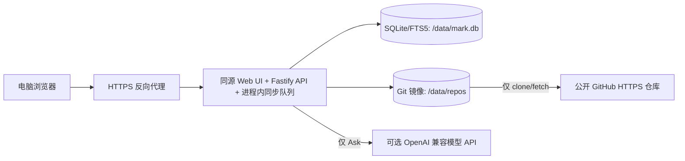

# Mark V0.1 实施计划与验收清单

> 状态：**已确认，实施中**。本文是开发与验收基线；清单项只有取得完整证据后才能勾选。依据：[产品文档](PRODUCT.md)、[技术设计](TECHNICAL.md)、[交互设计](DESIGN.md)、[Web 原型](PROTOTYPE.md)。若本文与前述文档冲突，先修正文档，不默默改变范围。按用户最新要求，当前优先推进功能，安全加固与 NAS 验收后续进行。

## 1. 背景、目标与边界

Mark 面向一位用户：在家用 NAS 上，通过**电脑 Web 浏览器**阅读多个持续更新的公开 GitHub 文档仓库，并保存自己的划线、笔记、书签和阅读位置。核心闭环是：**添加来源 → 阅读 → 留下标注 → 发现上游变化 → 复核标注 → 搜索或基于来源提问**。

- V0.1 包含：单用户登录；公开 GitHub HTTPS 仓库导入与只读同步；Markdown 与相对资源阅读；阅读状态、划线、笔记、书签；更新与差异；跨来源关键词搜索；可选 Ask；Docker 部署与备份恢复。
- V0.1 不包含：向上游写入、私有仓库、协作、PDF/EPUB、网页剪藏、原生桌面/手机应用、手机浏览器原型、离线编辑、向量数据库。本轮视觉验收以 `1586 × 992` 和宽度 `≥1280px` 的电脑浏览器为准。
- 仓库已具备 Web 与 API 初版；本清单仍是**验收要求**，不能把实现代码或静态原型当作通过证据。原型图片中的仓库内容、日期、数量和回答都是示例，不可作为固定业务数据。

## 2. 具体架构与数据约束

以 TypeScript、React + Vite、Node.js/Fastify、SQLite/FTS5 为 V0.1 实施栈。一个非 root Docker 容器提供静态页面、同源 API 与进程内同步任务；`/data` 持久化，外层代理负责 HTTPS。具体依赖版本与 NAS 文件系统适配，以首阶段实测后锁定。浏览器不直接访问 Git 镜像、数据库或模型密钥。

| 模块 | 对其他模块的接口承诺 | 必须保持的不变量 |
| --- | --- | --- |
| Auth/Settings | 初始化单用户口令、登录/退出、读取与修改设置 | 未设置口令不得开放书架；口令只存哈希，模型密钥仅在服务端；会话和修改操作受 Cookie、Origin/CSRF、限速保护 |
| Source/Sync | 添加/停用来源、启动任务、查询任务与更新 | URL 只允许公开 GitHub HTTPS 仓库；同一来源不并发发布；失败不得推进 `published_sha` |
| Content/Reader | 按 `source_id + published_sha + path` 读取正文与资源 | 只读已发布 commit；相对路径不得越出 Git tree；不执行来源 HTML/脚本 |
| Annotation/Reading | 保存标注、复核锚点、书签与阅读位置 | 个人数据独立于仓库；原文变化不删除笔记；`已完成` 只能由用户显式设置 |
| Search/Ask | 查询当前已发布文档；可选基于命中片段回答 | 索引与发布版本一致；引用可回到具体来源/文档/版本；无证据不生成伪引用 |

**发布事务：**每次同步先 clone/fetch、计算变更并准备内容，保护将发布的 Git commit，再用一个 SQLite 事务更新文档、FTS 索引、更新记录、标注状态和 `published_sha`。提交前，阅读与搜索仍指向上次成功版本；提交失败可重试且不会出现新索引配旧正文。历史差异依赖的旧 commit 必须保留。每次任务记录开始、阶段、结果和错误；重复处理同一 `from_sha → to_sha` 不产生重复可见更新。

**V0.1 拟定约定，随本计划一起审核：**“移除来源”先停用并从书架隐藏，保留个人数据和需要查看的历史版本；不提供无提示的级联清除。再次添加同一 URL 时提示恢复来源。首次口令由受控的本地部署初始化流程设置，未初始化时 Web 入口拒绝访问；不提供匿名首访设置。来源跟随 GitHub 当前默认分支；默认分支或历史变动时记录“历史变更”，完整校对当前树，不自动丢弃旧标注。

## 3. 核心流程与异常处理

| 流程 | 正常结果 | 异常及恢复 |
| --- | --- | --- |
| 登录 | 验证口令后进入书架，过期会话重新登录并恢复原目标页 | 错误口令原位提示、限速；未登录请求不泄露正文/笔记；未初始化拒绝 Web 访问 |
| 添加来源 | 校验公开仓库与默认分支，创建来源并返回异步导入任务；完成后可进入目录 | 非 GitHub/非 HTTPS、私有或不存在、重复 URL、超限仓库均解释原因；导入失败保留来源与重试入口 |
| 阅读与标注 | 按原目录阅读 Markdown/相对图片，保存书签、位置、划线和笔记；跨浏览器会话恢复 | 资源缺失给占位与来源路径；危险 HTML/链接被清理；保存失败保留输入并允许重试 |
| 同步与更新 | 定时/手动同步，展示新增、修改、删除及差异；受影响标注被重定位或进入待复核 | 网络失败、限流、仓库消失、历史改写、进程重启均保留上次发布版；任务可重试，不把失败显示成“无更新” |
| 复核标注 | 展示旧摘录与笔记，用户选择新文字后确认位置 | 文本重复或消失时不猜测锚点；允许稍后处理；删除文档的旧标注可查且标为“来源已移除” |
| 搜索与 Ask | 搜索跨来源返回标题、片段、来源与路径；Ask 只用检索到的片段并给可打开的引用 | 两字中文、三字以上中文及英文需用真实样例验证；无结果、索引故障、模型未配置/超时/无证据分别给明确提示，阅读不受影响 |
| 备份恢复 | 停止应用后备份数据库和 Git 镜像，恢复到新数据目录可登录、阅读旧标注、查看历史更新 | 缺少任一部分不得声称完整恢复；启动时发现不一致应报错，不静默丢弃个人数据 |

## 4. 页面状态契约

统一状态顺序：**首次加载 → 内容/空态/错误；已有内容上的后台操作 → 保留旧内容 + 局部进度 → 成功或可重试错误**。骨架屏只表示尚未取得真实内容，形状与页面栏位一致，不放假标题、假数量、假笔记；加载区有可读状态，完成或失败后退出骨架。提交按钮在请求中防重复，错误不清空用户输入。所有状态用文字说明，不能只靠颜色或动画。

| 页面/操作 | 首次加载与骨架屏 | 进行中 / 空态 / 失败后的可见处理 |
| --- | --- | --- |
| Library | 保留顶栏，继续阅读区与来源列表用对应行骨架 | 无来源显示添加入口；导入/同步时来源行显示阶段、旧内容仍可打开；失败显示原因与重试 |
| Reader | 保留三栏和面包屑；目录、正文、右栏分别占位，正文不闪出旧文档 | 资源加载失败仅影响该资源；文档删除显示来源状态与历史入口；标注保存显示局部进度及失败重试 |
| Updates / 差异 | 保留筛选和列表/双版本布局骨架 | 无变更显示明确空态；任务中展示阶段，不制造更新；差异不可读时保留批次与重试入口 |
| My Marks / 复核 | 列表与详情分别占位 | 无标注显示回到阅读入口；复核提交前保留旧摘录，失败后保留新选区和笔记 |
| Search | 弹层立即显示输入框；发起查询后仅结果区占位 | 空输入给操作提示；新查询进行中标记旧结果过期，不能把旧结果当新命中；无结果/故障给改词或重试 |
| Ask | 面板立即可见，发送后显示请求中和取消入口 | 未配置给设置入口；超时/无证据不给伪答案，保留问题并提供搜索结果入口 |
| 登录 / Settings / 添加来源 | 表单框架立即可用，读取已有设置时字段局部占位 | 提交中禁重复；校验或网络错误保留输入；密钥始终不明文回显 |

用可控延迟、失败响应和空数据分别检查上述状态；不能仅凭静态原型图验收。`Cmd/Ctrl + K`、上下键、Enter、Esc、焦点返回、可见焦点和正文缩放也需在宽屏浏览器实测。

## 5. 分阶段实施与完成门槛

| 阶段 | 工作范围 | 阶段完成证据 |
| --- | --- | --- |
| 0. 契约与样例 | 锁定依赖、API 错误/分页/任务状态契约；准备两个真实公开仓库和可控的本地 Git 测试仓库，后者只通过测试接口注入同步模块 | 记录版本、测试数据、预期结果及 NAS/等价 Docker 环境；生产来源校验仍只接受公开 GitHub HTTPS 仓库 |
| 1. 可登录阅读 | 单容器、单用户登录、Library、来源导入、Reader、Markdown 安全渲染 | 两个来源在宽屏浏览器可独立阅读；相对链接/图片可用；异常导入可重试；阶段相关骨架与空态可见 |
| 2. 同步与搜索 | 增量/历史变更、Updates/差异、FTS5 及中文短词方案 | 可控仓库新增/修改/删除可见；故障仍读旧版；搜索只命中当前发布版；中英文查询样例通过 |
| 3. 个人痕迹 | 标注、笔记、书签、阅读状态、自动/人工重定位、My Marks | 同步前后笔记不丢；重复文本和删除文件进入待复核；跨会话恢复位置 |
| 4. Ask 与交付 | 可选模型、引用校验、设置、NAS Docker 部署、备份恢复 | 无模型降级、引用可打开、密钥不泄露；目标环境重启及新目录恢复演练通过 |

每阶段先完成可重复的自动化检查，再按原型做浏览器实测；问题修复后重跑受影响的检查。阶段通过只表示该阶段证据齐备；**V0.1 验收须全部清单项通过并由项目所有者确认**。

## 6. V0.1 验收清单

执行时在每项后补充：测试输入/仓库 commit、命令或操作、实际结果、截图或日志路径、执行环境与日期。以下方框只有取得相应证据才可勾选；构建成功、文档审查与原型相似均不能代替功能验收。

### 功能与一致性

- [ ] **A01 来源**：添加两个不同的公开 GitHub Markdown 仓库；书架显示独立目录、同步状态和最近成功时间，重复/无效/私有 URL 有可理解的原位错误。（P-01）
- [ ] **A02 阅读**：打开标题、代码、表格、相对图片和相对链接；目录/正文/页内目录匹配发布版本；路径穿越、危险协议、脚本与仓库外符号链接不能被读取或执行。
- [ ] **A03 发布**：用可控仓库各造一次新增、修改、删除与可信重命名；更新列表、差异、当前正文及搜索结果对应同一发布 commit；已删除文档不进入当前搜索。（P-03）
- [ ] **A04 故障与幂等**：在 fetch、解析、数据库提交前分别注入故障，并重复同一同步任务；旧版正文/索引仍可读，`published_sha` 不误前进，更新记录不重复，重试可恢复。
- [ ] **A05 标注**：创建划线、笔记、书签后同步；原笔记和摘录保持；唯一匹配正确重定位，重复文本、丢失文本和删除文件进入待复核，人工确认后才换锚点。（P-02）
- [ ] **A06 阅读状态**：滚动位置自动保存；只有显式操作能设为“已完成”；重开浏览器及另一设备登录后可恢复状态和位置。（P-04）
- [ ] **A07 搜索**：两来源同词检索返回可打开的标题、片段、来源和路径；分别验证英文词、三字以上中文词、两字中文词及无结果，不把旧版/已删除文档当当前结果。（P-05）
- [ ] **A08 Ask**：未配置、超时、无命中时阅读与搜索可用；有命中时每条展示引用都能打开到实际命中的文档版本；伪引用被拒绝，所发送片段范围有提示。（P-06、P-07）
- [ ] **A09 来源移除**：移除前提示保留范围；停用后个人标注、阅读状态与所需旧版本仍可查；再次添加同一 URL 可明确恢复，不产生无提示的数据丢失。

### 界面状态与可用性

- [ ] **A10 骨架/加载**：对页面状态表中的页面和操作注入延迟响应；首次加载看到匹配页面结构的骨架/局部占位，返回真实内容后消失；后台同步不遮蔽旧正文。
- [ ] **A11 空态/失败**：分别注入空书架、零更新、零标注、零搜索结果、资源缺失、导入/同步/保存/模型失败；每种状态有原因或下一步，重试不丢表单输入或个人笔记。
- [ ] **A12 交互与视觉**：在 `1586 × 992` 及宽度 `≥1280px` 的电脑浏览器逐页对照 [原型](PROTOTYPE.md)；检查三栏阅读宽度、导航、密度、状态文案、无整页横向溢出；键盘操作与焦点恢复可用，不以颜色独自传达状态。

### 安全、部署与恢复

- [ ] **A13 登录与秘密**：未初始化/未登录/过期会话不能访问个人内容；错误口令限速；修改请求有 Origin/CSRF 保护；密码、模型密钥、笔记正文不出现在客户端配置和日志中。
- [ ] **A14 资源限制**：超大/异常仓库、恶意 Markdown、非法路径和非许可来源 URL/重定向目标被限制或拒绝；受影响来源报错，其他来源和旧发布版可用。
- [ ] **A15 NAS 运行**：非 root 单实例 Docker 在目标 NAS 启动；重启后来源、标注、阅读状态和设置保留；记录镜像/内存占用与实际文件系统行为。等价 Docker 环境只能作为阶段证据。
- [ ] **A16 恢复演练**：在目标 NAS 停止应用后备份数据库和 Git 镜像，在新目录恢复并完成登录、阅读旧标注、查看更新；记录步骤与结果，缺失文件时明确报错。（P-08）

## 7. 当前进展与后续验收

已完成可运行初版，并通过本地 TypeScript 检查、构建和自动化测试；浏览器已导入并阅读 `wuxiy/mark` 与 `ossu/computer-science`，以 `computer` 验证跨来源英文命中和来源筛选。书签、标注、更新差异、重复与无效来源提示、来源暂停/恢复，以及 `1280px` 与 `1586px` 宽屏布局已有局部验证；自动同步频率通过 API 测试和设置页表单检查，Compose 语法已检查。以上只覆盖局部证据，**A01–A16 尚未完成整项验收**；目标 NAS 容器、外部模型、完整故障注入和恢复演练仍待执行。后续改变范围或核心不变量时，先更新本计划与相关文档，再按新基线验收。
