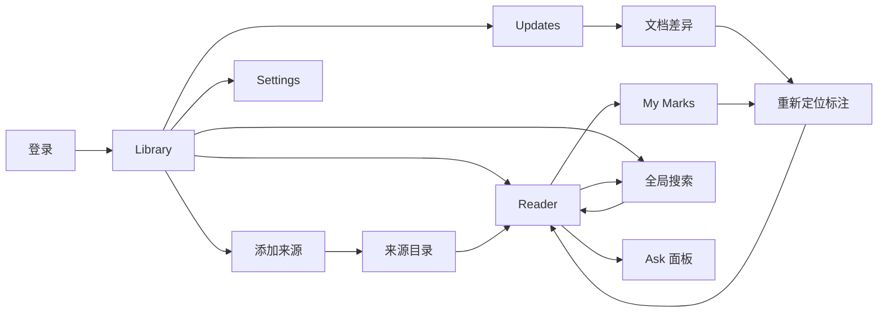

# Mark Web 产品原型

> 状态：已确认的 V0.1 原型包。Reader 原型是本轮视觉基准；其他页面按它延展。仓库已有可运行初版，完整对照验收尚未完成。

## 交付范围与使用方式

本轮只设计**电脑 Web 浏览器**中的页面，参考视口约 `1586 × 992`，优先覆盖 `≥1280px` 的浏览器窗口。不设计原生桌面客户端，也不交付手机浏览器视图；较窄窗口的布局需另行确定，不能直接把三栏压缩。

原型图片负责说明布局、层级、密度、颜色和主要组件形态。本文负责精确交互、状态、文案与跨页规则。图片中的仓库内容、日期、版本号、搜索结果数和 AI 回答都是**示例数据**，开发时必须使用实际来源与状态，不得照抄为固定值。产品范围和数据安全边界分别以 [PRODUCT.md](PRODUCT.md)、[TECHNICAL.md](TECHNICAL.md) 为准。

## 原型索引

| 顺序 | 页面或状态 | 图片 | 用户任务 |
| --- | --- | --- | --- |
| 0 | 单用户登录 | [login.png](prototypes/login.png) | 解锁个人知识库 |
| 1 | Library 空书架 | [library-empty.png](prototypes/library-empty.png) | 开始添加第一个来源 |
| 2 | Library | [library-v0.1.png](prototypes/library-v0.1.png) | 继续阅读、管理来源 |
| 3 | 添加来源 | [add-source-v0.2.png](prototypes/add-source-v0.2.png) | 验证并导入公开 GitHub 仓库 |
| 4 | Reader | [reader-v0.1.png](prototypes/reader-v0.1.png) | 阅读、划线、写笔记、保存进度 |
| 5 | Updates | [updates-v0.1.png](prototypes/updates-v0.1.png) | 浏览来源变更 |
| 6 | 文档差异 | [update-diff.png](prototypes/update-diff.png) | 查看旧版与当前版的具体变化 |
| 7 | My Marks | [marks-v0.1.png](prototypes/marks-v0.1.png) | 回访划线、笔记、书签与待复核项 |
| 8 | 重新定位标注 | [reanchor.png](prototypes/reanchor.png) | 将旧标注人工关联到当前原文 |
| 9 | 全局搜索 | [search-v0.1.png](prototypes/search-v0.1.png) | 跨来源找到当前文档 |
| 10 | Ask 面板 | [ask-v0.1.png](prototypes/ask-v0.1.png) | 基于来源片段提问并打开引用 |
| 11 | Settings | [settings-v0.2.png](prototypes/settings-v0.2.png) | 管理同步、模型、数据和登录密码 |

Reader 是用户指定的延展基准，其他页面依照其布局和视觉语言设计。已确认的实施计划为开发与验收基线；后续审核意见应同步更新本文和对应图片。

## 页面关系

全局导航只有 `Library`、`Updates`、`My Marks`；搜索常驻顶栏，设置由齿轮进入。`Ask` 是 Reader 内的按需操作。返回上一层后尽量恢复原筛选、选中项和阅读位置。未登录时只显示登录页；登录成功进入 Library，过期会话回到登录页并保留可恢复的目标地址。

## 视觉基线

| 项目 | 原型基线 |
| --- | --- |
| 色彩 | 主背景 `#FFFFFF`；次级表面 `#F8F9F9`；文字 `#18181B` / `#5D6268`；分隔线 `#E5E7E9`；操作强调 `#147D68` |
| 页面骨架 | 顶部单行全局导航；左侧上下文栏；主内容区。Reader、差异和标注复核按需出现右侧详情栏 |
| 阅读宽度 | Reader 正文约 `720–780px`，在宽屏窗口中保持可读行长；侧栏不可挤占到正文不可读 |
| 字体 | UI 使用系统无衬线字体与中文回退；正文约 `16px`、行高约 `1.7`；代码用等宽字；标题以字重和字号区分 |
| 组件 | 扁平列表、细分隔线、少量浅底选中态；圆角一般 `6–8px`；弹层有克制的遮罩与阴影 |
| 图标 | 单一线性图标语言；图标辅助文字，不单独承担关键状态语义 |

导航选中以深绿短下划线或浅绿行底表示。新增/主要确认动作用深绿实心按钮；普通跳转用文字或线框按钮。同步失败、待复核等状态必须同时有文字，不能只靠红/黄/绿。无营销 Hero、统计看板、大渐变和大面积卡片墙。具体视觉基线参见 [DESIGN.md](DESIGN.md)。

## 页面交互契约

### 登录与首次使用

- 登录页仅有密码，不出现邮箱、社交登录或多工作区。密码输入、显示切换、提交、错误提示和退出登录需可用。
- 首次设置管理员密码的引导属于部署/首次启动流程；不能在未设密码时让公开访问直接进入书架。
- 没有来源时显示空书架，主按钮 `添加来源` 打开同一个添加来源弹层。此时不显示空的“继续阅读”列表或虚构资料。

### Library 与来源导入

- 顶部先显示最近真实读过的文档，再显示来源列表。继续阅读行打开对应文档和上次位置；来源行进入该来源的目录或默认可读文档。
- 来源行至少显示名称、仓库标识、最近成功同步时间及状态。`有更新`、`同步中`、`已同步`、`同步失败，可重试` 分别有可区分文案；失败不把旧内容隐藏。
- `添加来源` 弹层输入公开 GitHub HTTPS URL。校验成功后显示来源名、实际默认分支与“只读同步”；可选填写显示名称。示例图使用 [OSSU Computer Science](https://github.com/ossu/computer-science) 作为**仅供展示的不同来源**。
- URL 无效、仓库非公开、与现有来源重复时，表单在原处解释原因，`添加并导入` 不可提交。提交后关闭弹层并显示导入任务进度；导入失败保留来源记录和重试入口。删除来源必须先说明个人标注与进度的处理方式，不可静默级联删除。

### Reader 与个人痕迹

- 左栏是当前来源的目录树，当前文档明确选中；顶栏面包屑显示来源和路径；右栏显示页内目录与当前文档的标注。正文、代码块、表格和图片按原仓库内容渲染。
- 滚动位置自动保存。`标记已完成` 是用户主动操作；完成后显示 `已完成` 和可撤销操作。图片上的勾选图标不表示滚动到底部会自动完成。
- 选中文字出现小工具条：四色划线、`笔记`、可选 `Ask`。划线保存后可点击查看/编辑笔记；书签作用于整篇文档。删标注需明确操作，不受上游同步隐式删除。
- 来源更新后，确定可重新定位的标注继续显示；位置不确定的标注进入 `需要复核`，原摘录和笔记照常保留。Reader 只显示当前发布版本，旧版从 Updates/标注详情进入。

### Updates、差异与复核

- Updates 默认按同步批次和来源分组，标明新增、修改、删除；列表摘要不泄露大量 Git 信息。点击 `查看差异` 才进入文档差异页。
- 差异页显示发布前后版本和行级变化，同时列出受影响标注。旧版与新版 commit、时间、变更行数都来自实际同步记录；图片中的数字与日期不是契约。未发生变化的文档不制造更新行。
- 点击 `前往复核` 进入标注重新定位。右侧始终保留原文摘录与个人笔记；用户在当前文档明确选择新的文字后，`确认新位置` 才可用。取消或稍后处理都不丢失笔记。删除文档保留旧标注，但需显示“来源已移除”。

### My Marks

- 顶部筛选：`全部`、`划线`、`笔记`、`书签`、`需要复核`；数量由真实数据计算。左侧列表按来源归类，点击后右侧展示原摘录、笔记、来源路径和状态。
- 正常标注可回到 Reader 对应位置；待复核标注先展示旧引用和当前文档入口。笔记编辑和删除只改个人数据，不写入 Git 镜像。

### Search 与 Ask

- 顶栏搜索和 `Cmd/Ctrl + K` 打开同一搜索弹层。输入后显示标题、匹配片段、来源与路径；来源筛选仅影响结果，不修改原文。上下键选择、Enter 打开、Esc 关闭；关闭后焦点回到触发处。结果数由真实查询返回，不硬编码图片中的数字。
- 搜索只返回当前发布且可读的文档。无结果时给出清除来源筛选或修改关键词的入口；同步失败仍检索上次成功发布版本。
- Reader 的 `Ask` 打开右侧面板；正文继续可见。提问前文案为：`相关文档片段将发送至已配置的模型。` 回答中的引用必须链接到实际检索片段对应的文档版本；无法验证的引用不显示。
- 未配置模型时显示 `配置模型后，可针对当前文档提问。`，并提供设置入口；模型超时或没有足够证据时仍可返回搜索结果，不影响 Reader。图片中的回答只是排版样例，不是知识事实或标准答案。

### Settings

- 页面集中管理自动同步开关/频率、Ask 模型配置、数据与备份说明、密码修改。个人密钥不明文回显，也不出现在图中示例文案或日志中。
- 模型说明统一为：`提问时会将相关文档片段发送至已配置模型。` 发送范围包括检索片段，不能写成“只发送用户选中的文字”。
- `/data` 是容器持久化目录；备份说明指向 [部署与恢复文档](DEPLOYMENT.md)。目标 NAS 恢复演练尚未完成，界面不假装已有一键备份功能。

## 必须覆盖的状态

| 功能 | 空态 / 进行中 | 失败与恢复 |
| --- | --- | --- |
| Library | 无来源时用空书架原型；导入时显示任务阶段 | URL 重复、不可访问、导入失败有原位错误与重试 |
| Sync | 来源行显示同步中，旧版仍可读 | 网络或远端故障保留旧发布版本，并给重试 |
| Reader | 文档加载时维持导航骨架 | 图片丢失、文档被上游删除时说明来源状态 |
| Mark | 保存中防重复提交；成功后原位可见 | 锚点歧义进入待复核，笔记永不消失 |
| Search | 输入为空给简洁提示；查询中不闪烁旧结果 | 无结果、索引暂不可用给清晰提示 |
| Ask | 未配置显示设置入口；请求中可取消 | 超时或无证据提示原因与来源搜索结果 |
| Session | 登录后恢复目标页 | 凭据错误和会话过期不泄露个人内容 |

## 开发验收对照

开发顺序可按 [TECHNICAL.md](TECHNICAL.md) 的四阶段推进。每个阶段完成时，至少用同一宽屏浏览器视口对照对应原型检查：导航位置、主栏宽度、标题/正文层级、列表密度、强调色、弹层尺寸、标注状态与实际交互。代码构建通过不等于原型符合；需用真实来源数据走通 [PRODUCT.md](PRODUCT.md) 中 P-01 至 P-08 的验收输入。

本原型包是静态图片与交互约定；仓库中的可点击 Web 初版和其运行截图需另行验收。图片由内置 ImageGen 生成，不包含手机视图。
