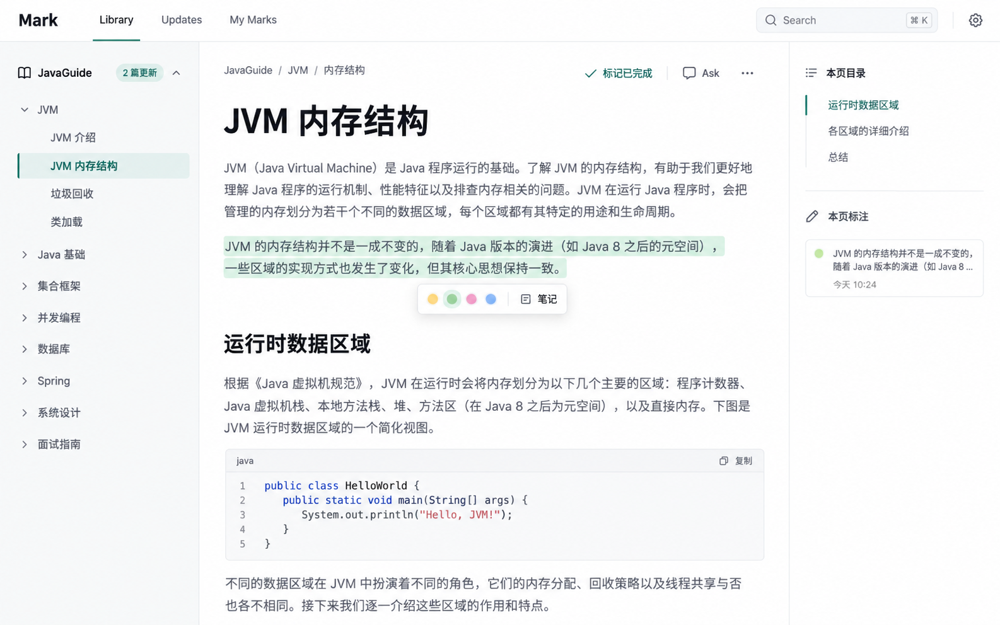

# Mark

> 把持续更新的开源文档仓库放进同一个书架，在浏览器中阅读、标注，并回访上游变化。



> [!NOTE]
> 图片是 Reader 的设计原型，并非运行截图。Mark V0.1 已有可运行的 Web 页面与 API；[完整验收清单](IMPLEMENTATION_PLAN.md)中的 A01–A16 尚未逐项完成。

Mark 面向单用户、电脑 Web 浏览器。一个知识源对应一个公开 GitHub 仓库：应用只读取上游 Git 版本，划线、笔记、书签和阅读位置单独保存在本地数据目录，不写回原仓库。

## 主要功能

- **阅读**：按来源目录打开 Markdown，显示页内目录、代码、表格，以及仓库内的相对图片和文档链接。
- **留下标记**：保存划线、笔记、书签、阅读进度和手动设置的完成状态；上游内容变化后，无法可靠定位的标注进入待复核。
- **跟进更新**：手动或定时同步来源，查看新增、修改、删除的文档和前后版本差异；可暂停、恢复或移除来源。
- **找回内容**：跨来源按关键词搜索当前文档；可选 Ask 在配置兼容模型后，基于检索片段回答并列出文档引用。
- **统一登录**：可接入 Work-OS authentik，使用同一 Owner 身份；保留 Mark 密码登录和应用内单独退出。

## 快速开始

需要 **Node.js ≥ 24.12.0**、npm 和 Git。全新安装时，在仓库根目录执行：

```bash
npm ci
mkdir -p secrets
node -p "require('node:crypto').randomBytes(24).toString('hex')" > secrets/initial-password
chmod 600 secrets/initial-password
npm run build
MARK_DATA_DIR=.data MARK_INITIAL_PASSWORD_FILE=secrets/initial-password npm start
```

打开 <http://127.0.0.1:3100>，使用 `secrets/initial-password` 中的密码登录，再从 **Library → 添加来源** 导入公开 GitHub 仓库。密码文件只应在全新数据目录首次启动前生成：密码哈希写入数据库后，重写文件不会修改登录密码。`secrets/` 和 `.data/` 已被 Git 忽略。

开发时可以在两个终端分别启动 API 和 Vite 页面：

```bash
MARK_DATA_DIR=.data MARK_INITIAL_PASSWORD_FILE=secrets/initial-password npm run dev:api
```

```bash
npm run dev:web
```

开发页面默认在 <http://127.0.0.1:5173>，`/api` 请求代理到本机 `3100` 端口。

## 配置与部署

`npm start` 从进程环境读取配置，**不会自动加载 `.env`**。常用变量如下：

| 变量 | 用途 | 默认值 |
| --- | --- | --- |
| `HOST` / `PORT` | 服务监听地址和端口 | `127.0.0.1` / `3100` |
| `MARK_DATA_DIR` | SQLite 数据库与 Git 镜像目录 | `.data` |
| `MARK_INITIAL_PASSWORD_FILE` | 首次初始化时读取的密码文件 | 未设置 |
| `MARK_SYNC_INTERVAL_MINUTES` | 新数据库的初始同步间隔，之后在 Settings 调整；`0` 关闭定时检查 | `60` |
| `MARK_SECURE_COOKIE` | 经 HTTPS 访问时设为 `1` | `0` |
| `MARK_MODEL_BASE_URL` / `MARK_MODEL_NAME` | 同时设置后启用兼容 Chat Completions 的 Ask | 未设置 |
| `MARK_MODEL_API_KEY` | 模型服务要求密钥时设置 | 未设置 |

Linux 主机完成构建后，可以让页面与 API 由同一进程在 `13200` 端口提供：

```bash
HOST=0.0.0.0 PORT=13200 MARK_DATA_DIR=./data MARK_INITIAL_PASSWORD_FILE=secrets/initial-password npm start
```

长期运行可交给 systemd 托管；当前服务器使用原生 Node + systemd，浏览器经 HTTPS 入口访问。详见 [部署与备份](DEPLOYMENT.md)和 [authentik 接入](docs/AUTHENTIK.md)。仓库也保留 Docker Compose 配置：`.env.example` 中的 `MARK_PORT`、`MARK_DATA_HOST_DIR` 是 **Compose 配置**，不是直接运行 Node 时的环境变量。

> [!IMPORTANT]
> 备份需覆盖整个数据目录，包括 SQLite 数据库、可能存在的 WAL 文件与 `repos/` Git 镜像。只有数据库不足以保证历史版本仍可阅读；完整恢复演练尚未通过验收。

## 开发与验证

| 命令 | 作用 |
| --- | --- |
| `npm run check` | 前后端 TypeScript 检查 |
| `npm test` | 运行来源、发布、登录及阅读 API 等自动化测试 |
| `npm run build` | 检查类型并构建页面与 API |
| `npm start` | 启动已构建的同源 Web 服务 |

当前代码已通过 `npm run build` 和 `npm test`（26 项通过、0 项跳过，包含 OIDC 异常用例）；此前在浏览器对两个公开仓库做过导入、阅读和跨来源英文搜索的局部检查。这些结果不能代替多来源长期同步、外部模型和备份恢复的完整验收。电脑宽屏浏览器是当前设计范围。

## 项目文档

| 文档 | 内容 |
| --- | --- |
| [产品文档](PRODUCT.md) | 用户场景、范围与产品验收标准 |
| [技术文档](TECHNICAL.md) | 模块、数据模型与同步方案 |
| [设计文档](DESIGN.md) | 阅读器交互与视觉规范 |
| [Web 原型](PROTOTYPE.md) | 页面结构、流程与状态设计 |
| [实施与验收清单](IMPLEMENTATION_PLAN.md) | 分阶段工作和 A01–A16 验收项 |
