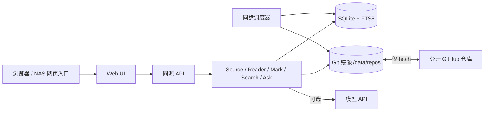

# Mark 技术设计

> 状态：V0.1 技术设计，已有初版代码与局部本地验证；完整验收状态见 [实施计划](IMPLEMENTATION_PLAN.md)。产品边界以 [PRODUCT.md](PRODUCT.md) 为准；实现偏离本文时应记录原因和验证证据。

## 设计目标与决策

| 主题 | V0.1 决策 | 原因 |
| --- | --- | --- |
| 项目底座 | 独立实现轻量核心；参考现有开源项目的思路，不直接 Fork 整套应用 | 多来源只读阅读是核心模型，避免继承编辑器或重型学习流水线 |
| 运行形态 | 单个 Docker 应用容器，静态前端与 API 同源，后台同步任务在同一进程内受控运行 | 单用户 NAS 环境便于部署、备份和排障 |
| 实施栈 | TypeScript、React + Vite、Node.js/Fastify、SQLite | 与 Git、Markdown、阅读器和 Web 交互共享语言；当前依赖版本记录于 `package-lock.json` |
| 来源 | 首版仅公开 GitHub HTTPS 仓库，跟随默认分支 | 保持导入与凭据边界简单 |
| 检索 | SQLite FTS5 关键词检索；语义索引延后 | 搜索与元数据可在同一事务中更新，避免另一个持久化服务；中文短词需单独验证 |
| AI | 可选的 OpenAI 兼容 API；先检索后回答 | NAS 无须运行模型，Ask 故障不影响阅读 |
| 部署 | 持久化 `/data`，由应用负责单用户登录，外层反向代理提供 HTTPS | 保护个人记录与模型密钥，适配浏览器/NAS 网页入口 |

上述技术栈与主要模块已有初版实现；Docker 容器与目标 NAS 的运行仍待验证。调研对话后期已将“直接 Fork OpenKnowledge”改为“自建轻量核心并借鉴 OpenKnowledge、Luminary”；本文采用后者。外部项目仅作设计参考，复制代码前应核对当时的许可证、版本和适用性：[OpenKnowledge](https://github.com/inkeep/open-knowledge)、[Luminary](https://github.com/nupsea/luminary)。

## 系统边界

**Source World** 是上游仓库镜像，只接收 fetch，不接受用户内容写入，不进行 commit/push。**Personal World** 是 SQLite 中的来源配置、标注、书签、阅读状态、更新记录与应用配置。每个文档的来源、相对路径和发布 commit 可回溯。

源仓库作为不可直接修改的 Git 镜像保存；阅读器按应用已发布的 commit 读取 `commit:path`，不读取会被同步改变的工作目录。即使 fetch 已完成，用户仍看到上一次成功发布的版本，直到文档元数据、搜索索引、更新记录和标注状态一起提交。

## 模块边界

| 模块 | 负责 | 不负责 |
| --- | --- | --- |
| Source Manager | 地址校验、默认分支解析、来源配置与状态 | 页面渲染、个人笔记 |
| Sync | 每来源串行 clone/fetch、版本比较、变更清单、发布 | Git push、合并用户改动 |
| Content | Markdown 解析、目录、相对链接/资源解析、纯文本提取 | 修改上游文件 |
| Reader | 按发布版本读取正文与资源、阅读位置 | 同步流程 |
| Annotation | 划线/笔记定位、重定位、待复核 | 原仓库内联编辑 |
| Search | FTS 索引与跨来源查询 | 无来源的自由生成回答 |
| Ask | 检索片段、模型调用、引用校验 | 更改原文或自动写入笔记 |
| Auth/Settings | 单用户会话、模型配置、同步设置 | 多租户权限模型 |

模块通过应用服务和存储接口协作。前端不直接读取 `/data`，同步任务不调用页面组件。首版不拆成微服务或独立 worker；进程内队列仍需持久化同步状态，并保证同一来源不能并发发布。

## 数据模型与不变量

| 表 | 主要字段 | 约束 |
| --- | --- | --- |
| `sources` | `id`, `name`, `url`, `branch`, `published_sha`, `sync_status`, `last_sync_at`, `enabled` | URL 规范化后唯一；每个来源独立发布版本 |
| `documents` | `id`, `source_id`, `path`, `title`, `status`, `current_sha`, `content_hash` | 稳定 ID；当前路径在同一来源内唯一；删除为软删除 |
| `sync_runs` | `id`, `source_id`, `from_sha`, `to_sha`, `status`, `error`, `started_at`, `finished_at` | 失败不能推进 `published_sha` |
| `document_changes` | `sync_run_id`, `document_id`, `old_path`, `new_path`, `kind` | `added/modified/deleted/renamed` 可回溯 |
| `annotations` | `id`, `document_id`, `kind`, `note`, `color`, `exact`, `prefix`, `suffix`, `start_offset`, `end_offset`, `created_sha`, `anchor_status` | 原文变化不能删除笔记；位置不确定时待复核 |
| `reading_states` | `document_id`, `state`, `position`, `updated_at` | `completed` 只能由明确操作设置 |
| `bookmarks` | `document_id`, `created_at` | 与当前文档位置无关 |
| `ask_runs` | `id`, `question`, `status`, `created_at` | 不保存模型密钥和无效引用 |

`documents.id` 是内部稳定标识，不以路径哈希直接生成。检测到可信 rename 时沿用 ID；无法确认的重命名按删除和新增处理，并在旧文档保留标注与“已从来源移除”的状态。搜索虚拟表只包含当前可读文档；标题、正文纯文本、`source_id`、`document_id`、`published_sha` 参与可追溯结果。文档路径仅允许 Git tree 内的相对路径，拒绝 `..`、绝对路径和仓库外符号链接。

## Git 同步与发布

1. 校验来源 URL 仅指向允许的公开 GitHub HTTPS 仓库；设置克隆大小、文件数量和单文件大小上限，避免异常仓库拖垮 NAS。
2. 对来源取独占锁，创建 `sync_runs=running`。首次 clone 或后续 fetch 只改变 Git 对象和远端引用，不改变已发布版本。
3. 比较 `published_sha` 与目标 commit，生成新增、修改、删除及可确认的重命名；若历史被改写，标记“历史变更”，对当前树做完整校对。
4. 解析受影响的 Markdown 与资源，计算标题、内容哈希、纯文本和引用链接；为标注计算新定位结果，生成 FTS 更新计划。
5. 先为将发布的 commit 建立受保护的本地引用，再在**一个 SQLite 事务**内更新文档、FTS、标注状态、更新记录与 `sources.published_sha`。提交后才能对用户显示本轮成功。
6. 失败时保持旧 `published_sha`、旧索引和旧标注位置；写入错误、允许重试。重复执行相同 `from_sha → to_sha` 应得到同一可见结果。

更新的 Git 对象必须在查看更新记录与历史标注期间可读；清理受保护引用要有保留策略，不能只依赖远端仍保有旧 commit。同步调度采用可配置间隔和启动后错峰执行。网络失败、限流、仓库删除只影响对应来源。

## Markdown 与标注

Markdown 通过统一的解析流水线生成标题目录、可阅读 HTML、纯文本和可定位文本节点。原始 HTML 与不可信 URL 必须经过清理；脚本、事件属性及危险协议不能进入页面。相对图片和链接由后端根据 `source_id + published_sha + path` 解析，既保持仓库内相对关系，也避免文件路径穿越。

创建标注时记录选中文本 `exact`、前后文 `prefix/suffix`、文本偏移、文档哈希与 commit。更新后按以下顺序重定位：

1. 原偏移处文本与上下文一致 → 保持定位。
2. 全文唯一的 `exact` 命中且上下文吻合 → 更新位置。
3. 多候选时用上下文和邻近结构评分；只有达到明确阈值且领先第二候选时才自动重定位。
4. 无命中或歧义 → `needs_review`，保存原引用和笔记，供用户手工选择新位置。

`anchored/relocated/needs_review` 是数据状态，UI 分别显示“位置正常/已随原文调整/需要复核”。不允许为了减少待复核数量而把低置信度标注自动挂到错误段落。对代码块、重复段落、跨节点选区和文件重命名准备独立样例。

## 搜索与 Ask

首版用 FTS5 对当前发布版本建立标题与正文索引，支持来源过滤、路径展示和匹配片段。索引更新与 `published_sha` 在同一事务中完成；用户不会看到新索引却打开旧正文，或看到已删除文件的当前搜索结果。[SQLite 官方说明](https://www.sqlite.org/fts5.html)显示，默认 `unicode61` 以连续字符为词，`trigram` 才支持一般的子串匹配，且全文查询不能匹配少于三个字符的片段。因此实现前要用真实中英混排资料验证：英文词、三字以上中文词和两字中文词。候选方案是英文词索引 + 中文 trigram，两字查询回退到受限范围的文本匹配；若索引体积、响应时间或结果质量不达标，再比较应用内搜索引擎，不能以“FTS5 已接入”代替中文搜索验收。

Ask 只在用户配置模型后启用：关键词检索 → 选取有限片段 → 附上 `source_id/document_id/sha` 发送给模型 → 接收回答 → 只展示能映射回已检索片段的引用。模型不可用、超时或无命中时给出可继续阅读的搜索结果。来源文档被视为不可信数据，文档中出现的“指令”不能更改系统行为。密钥仅保留在服务端配置中，不写入浏览器、日志或问答记录；网络请求应明确告知会把所选片段发给外部模型。

## 接口草案

| 路径 | 用途 |
| --- | --- |
| `POST /api/sources`, `GET /api/sources` | 添加来源、查看书架 |
| `POST /api/sources/:id/sync`, `GET /api/sources/:id/updates` | 手动同步、查看更新 |
| `GET /api/documents/:id`, `GET /api/documents/:id/assets/*` | 读取已发布正文与仓库内资源 |
| `GET /api/search?q=`, `POST /api/ask` | 跨来源检索与可选问答 |
| `POST /api/annotations`, `PATCH /api/annotations/:id` | 创建标注、编辑笔记或确认新锚点 |
| `PUT /api/reading-states/:documentId` | 保存阅读状态与位置 |

这是边界示意，并非现有 API 契约。实现前应统一错误结构、分页、输入校验与幂等键；同步接口返回任务状态，不在 HTTP 请求内等待大型仓库导入完毕。

## NAS 部署、安全与恢复

当前持久化目录：`/data/mark.db`、`/data/repos/`。容器配置使用固定非 root 用户，应用数据卷可写，仓库镜像不暴露为静态目录。SQLite 数据库与 Git 镜像应置于 NAS 本地文件系统；具体文件系统与锁行为需在目标设备验证。单实例运行，避免多个容器同时写同一数据库或仓库。

首次启动通过本地密码文件设置单用户凭据并保存密码哈希；会话使用同源 Cookie、CSRF 校验和登录限速。当前模型密钥通过部署环境变量传入，改用 Docker secret 文件属于后续加固。远程访问应由 HTTPS 反向代理承接，应用仍要求登录；不把裸端口直接暴露到公网。同步任务在数据库记录阶段、时间和错误；服务日志不记录文档正文、笔记或密钥。

备份应覆盖**数据库与 Git 镜像**，最简单的 V0.1 流程是在停止应用后复制数据目录；运行中备份则需使用 [SQLite 一致性备份机制](https://www.sqlite.org/backup.html)并协调 Git 镜像快照。数据库保存个人数据，Git 镜像保存可重现的旧版本与差异。只备份数据库虽可保留个人记录，但远端删除、改写历史或离线时可能无法恢复对应原文。首版交付前必须实际执行一次“备份 → 新目录恢复 → 登录 → 阅读旧标注 → 查看更新”的演练，并写下结果。

## 实施顺序与验证门槛

| 阶段 | 产出 | 必须提供的证据 |
| --- | --- | --- |
| 1. 来源与阅读 | 单容器骨架、登录、两个来源导入、Markdown 阅读 | 在目标 NAS 或等价 Docker 环境读到两个仓库的正文和相对资源 |
| 2. 同步与搜索 | 增量更新、更新记录、FTS 搜索 | 本地测试仓库分别新增/改动/删除；同步失败后旧版本仍可读；搜索与发布版本一致；真实资料中的英文词、中文两字与三字以上查询可用 |
| 3. 个人痕迹 | 标注、笔记、书签、阅读状态及待复核 | 同步前后笔记不丢；重复文本与删除文件样例正确进入待复核 |
| 4. Ask 与交付 | 可选模型、引用、Docker 文档、备份恢复 | 无模型降级、引用可打开、密钥不进日志、NAS 重启及恢复演练 |

目前已有本地构建、自动化测试和两个公开仓库的浏览器导入、阅读及跨来源英文检索证据，但不足以宣称任何阶段完整验收通过。镜像体积、内存占用、多来源中文搜索质量和 NAS 文件系统行为仍需实测。
